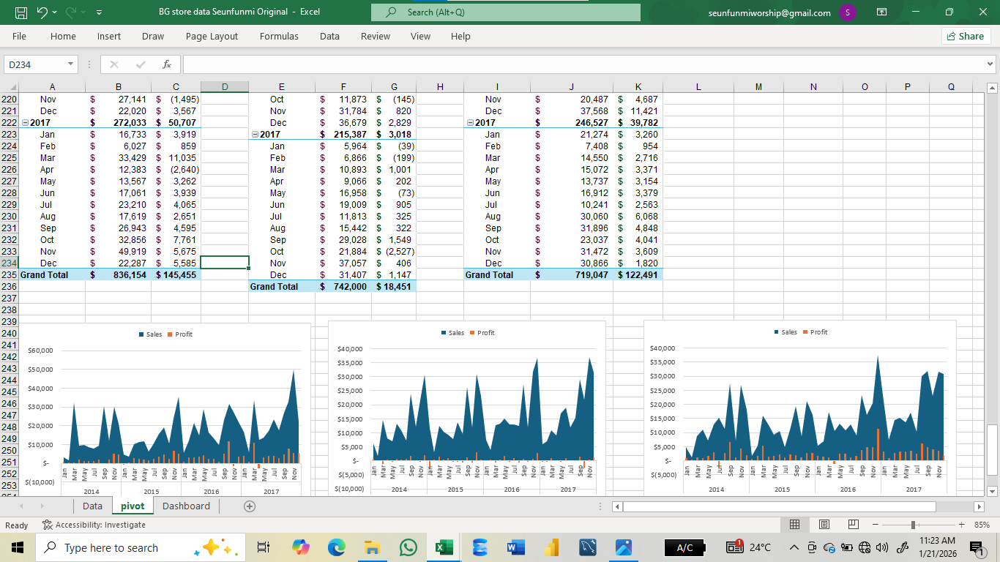

# 📊 BG Stores Sales Analysis Dashboard

## 📖 Project Overview
This project involves analyzing sales data for **BG Stores**, a US-based retail company, to identify trends, top-performing products, and regional profitability. The goal was to transform raw sales records into an interactive dashboard that aids stakeholders in making data-driven decisions.

*(Note: To interact with the slicers, please download the Excel file.)*

## ❓ Problem Statement
BG Stores needed to understand their performance over the last 4 years (2014-2017). The key business questions addressed in this analysis include:
- Which product categories and sub-categories generate the most revenue?
- How does profitability vary across different regions (Central, East, South, West)?
- What are the sales trends over time (seasonality)?
- Which products are contributing to losses despite high sales volume?

## 🛠 Tools Used
- **Microsoft Excel**
  - **Data Cleaning:** Removed duplicates, formatted dates, and handled missing values.
  - **Pivot Tables:** Used for summarizing data by category, region, and time periods.
  - **Dashboarding:** Created an interactive interface with Slicers and dynamic charts.

## 🔍 Key Insights & Findings
Based on the analysis of the dataset:
1.  **Total Performance:** The store generated **$2,297,201** in Total Sales and **$286,397** in Total Profit over the analyzed period.
2.  **Top Category:** **Technology** is the highest revenue generator ($836K), followed by Furniture and Office Supplies.
3.  **Profitability Issues:** While **Furniture** generates high sales ($742K), it has the lowest profit margins compared to Technology and Office Supplies.
4.  **Regional Analysis:** The West region appears to be a strong performer, while analysis is required for the Central region to optimize profit margins.
5.  **Seasonal Trends:** Sales tend to spike towards the end of the year (Q4), suggesting strong holiday performance.

## 📂 Data Structure
The raw data contained the following key columns:
- **Order Date & Ship Date:** For time-series analysis.
- **Segment & Region:** For customer demographic grouping.
- **Category & Sub-Category:** Hierarchical product data.
- **Sales, Quantity, Discount, Profit:** Quantitative metrics used for KPIs.

## 📷 Gallery
**Pivot Table Analysis**

*Snapshot of the backend analysis summarizing Sales and Profit by Category.*

**Raw Data View**

*Snapshot of the cleaned dataset used for analysis.*

## 🚀 How to Use This Repository
1.  **Clone the repository** or download the ZIP file.
2.  Open `BG_Stores_Dashboard.xlsx` in Microsoft Excel.
3.  Use the **Slicers** on the dashboard (left panel) to filter by:
    - Year/Month
    - Region
    - Sub-Category

---
*Author: [Oluwaseun Michael Akinyemi]*
*Connect with me on [https://www.linkedin.com/in/oluwaseun-akinyemi-66774422b?utm_source=share&utm_campaign=share_via&utm_content=profile&utm_medium=android_app]*

